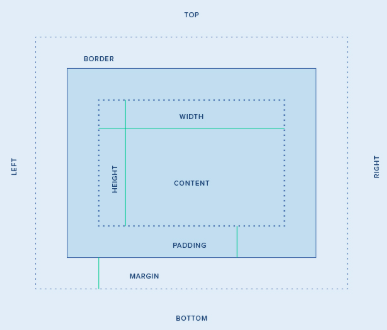

# cssCheatSheet

The most complete and compact CSS cheat sheet in the entire world!

# Table of Contents

1. [Adding CSS methods](#Adding-CSS-methods)
2. [Syntax](#Syntax)

## Adding CSS methods

- Inline style

direct in the html (NO!)

```html
<tag style="property: value;"></tag>
```

- Embedded Style

```html
<head>
  <style type="text/css">
    selector {
      property: value;
    }
  </style>
</head>
```

- External Style Sheet

```html
<head>
  <link rel="stylesheet" type="text/css" href="style.css" />
</head>
```

## Syntax

```css
selector {
  property: value;
  }
}
```

# Selectors

```css
*  /* all elements */
tag  /* all tag elements */
tag *  /* all tag elements within tag */
tag tag2 /* all tag2 elements within tag */
tag, tag2 /* all tag and tag2 elements*/
tag > tag2 /*tag2 is a child of tag*/
tag + tag2 /*tag2 preceded by tag*/
.class /*Elements with class ‘class’*/
tag.class /*All tags with class ‘class’*/
#id /*Element with id ‘id’*/
tag#id /*Tag with id ‘id’*/
```

# Pseudo-selectors

```css
:active /*Adds style to active element*/
:after /*Adds content after element*/
:before /*Ads content before element*/
:first­-child /*Adds style to first child*/
:first-letter /*Adds style to first character*/
:first-line /*Adds style to first line*/
:focus /*Adds style to focused element*/
:hover /*Adds style when mouse is over*/
:link /*Adds style to unvisited link*/
:visited /*Adds style to visited link*/
```

# Size and colors

## Relative sizes

```css
em /* */
rem /* */
ex /* */
ch /* */
vw
vh
vmin
vmax

```

## Absolute sizes

```css
cm /*centimetros*/
mm /*milimetros */
in /*inches*/
px /*pixels */
pt /*pixels */
pc /*pixels */
```

## Colors

```css
#ff00ff /*hex*/
rgb(255,0,255)  /*red green blue */

```

# Box Model



# Box 

```css
margin: /*size*/ 
  margin-top
  margin-bottom 
              auto
              length
              %
  margin-right
  margin-left 
              auto
              height
              % 
  margin-bottom 


padding
  padding-top 
  padding-right 
  padding-bottom 
  padding-left 
  
border: 5px solid red /*width, style, color*/
  border-top
  border-right 
  border-bottom 
  border-left 
  border-color 
  border-top-color
  border-right-color 
  border-bottom-color 
  border-left-color 
  border-style
              none /* Default value. Specifies no border */
              hidden /*The same as "none", except in border conflict resolution for table elements*/
              dotted
              dashed
              solid
              double
              groove /*Specifies a 3D grooved border. The effect depends on the border-color value*/
              ridge
              inset
              outset
              initial /*Sets this property to its default value*/
              inherit /*Inherits this property from its parent element*/
  border-top-style 
  border-right-style 
  border-bottom-style 
  border-left-style
  border-width 
  border-top-width 
  border-right-width 
  border-bottom-width
  border-left-width;
```

# Text
```css
font-family: /*Specifies the font family*/
font: 
          normal
          bold
          bolder
          lighter
          int 
font-size:/*Specifies the font size*/
font-style
          normal
          italic
          oblique
          inherit
font-variant
          normal
          small-caps
          inherit
color /* Sets the color of text */

line-height
            normal
            int
            %
            inherit
text-align
            left
            right
            center
            justify
            inherit
text-decoration
            none
            underline
            overline
            line-through
            blink
            inherit
text-indent
            int
            %
            inherit
text-transform
            none
            capitalize
            uppercase
            lowercase
            inherit
vertical-align
            int
            %
            baseline
            sub
            supertop
            text-top
            middle
            bottom
            text-bottom
            inherit
white-space
            normal
            nowrap
            pre
            pre-line
            pre-wrap
            inherit
word-spacing
            normal
            length
            inherit

```

# Positioning
```css
position
            absolute
            fixed
            relative
            none 
            static /*is not positioned in any special way*/
            inherit
float       left
            rigth
            none
            inherit
top, right, bottom, left
/* Sets the offset from the edge */
clear
            left
            right
            both
            none
            inherit
display
/* Specifies element placing in the document flow */
overflow	
visible | hidden | scroll | auto | inherit
visibility
visible | hidden | collapse | inherit
z-index
auto | int | inherit
```
# Dimensions
```css
height
auto | int | % | inherit

max-height
none | int | % | inherit
max-width

none | int | % | inherit
min-height

int | % | inherit
min-width

int | % | inherit
width

auto | int | % | inherit
```
# BACKGROUNDS
```css
background
                content-box radial-gradient(crimson, skyblue)
background-color
                color
                transparent
background-image
background-repeat
                  repeat
                  repeat-x
                  repeat-y
                  no-repeat
background-attachment
background-position
background-size
background-clip
background-image /*url*/

```

# UI
```css
background
Format:
background (color) (image)

  (repeat) (position)
cursor
        help
        wait
        crosshair
        not-allowed
        zoom-in
        grab

quotes
Set type of quotation marks
```


